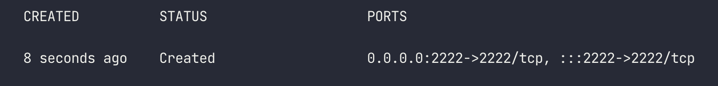

## Docker Engine API

### 실행 환경
> ubuntu 20.14 LTS

### Docker Daemon 실행하기
```shell
sudo dockerd -H tcp://0.0.0.0:2375 -H unix:///var/run/docker.sock --debug
```
* 2375 포트를 개방하여 dockerd를 실행합니다.

### List Containers
```shell
GET http://192.168.0.129:2375/containers/json
```

### Create Container
```shell
POST http://192.168.0.129:2375/containers/create?name=test-hello3

{
    "Image": "hello-world",
    "Cmd": [
        "/bin/bash"
    ],
    "ExposedPorts": {
        "2222/tcp": {}
    },
    "HostConfig": {
        "PortBindings": {
            "2222/tcp": [
                {
                    "HostIp": "",
                    "HostPort": "2222"
                }
            ]
        }
    }
}
```

```shell
response:
{
    "Id": "9f5f10067551d0dfc49e5f9866fe64085925128179f05bc0bc5fd8bbc93643de",
    "Warnings": []
}
```


위는 생성된 컨테이너의 `PORTS` 정보입니다. 정상적으로 포트바인딩이 되었습니다.


## REFERENCES
* https://docs.docker.com/engine/api/v1.41