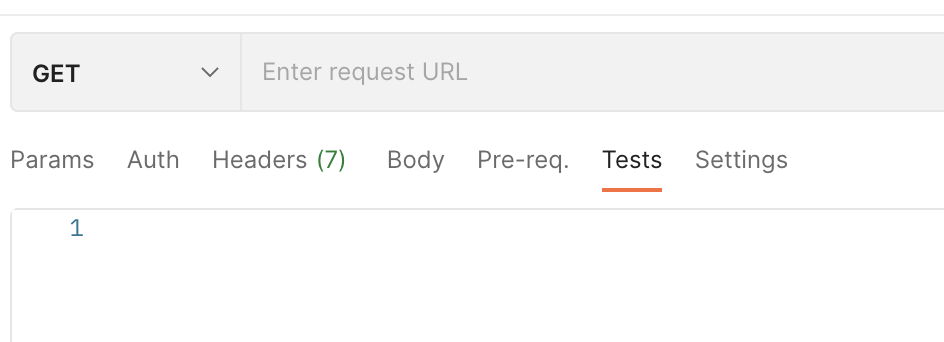
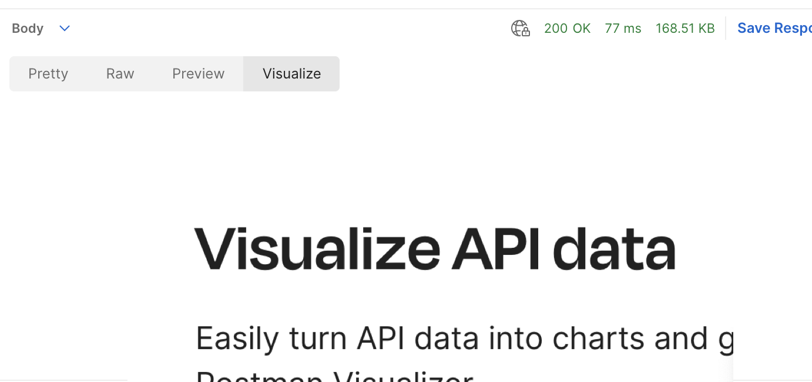

# Postman API Response 값으로 이미지 띄워보기!
목표는 Postman API 요청을 통해 얻은 이미지의 바이트 값을 가지고 정상적으로 데이터를 가져왔는지 실제 이미지를 띄워보고 싶습니다. Postman Visualize를 이용해서 이미지를 띄울 수 있습니다.

## Postman Visualize란?
Postman Visualize API와 HTML, CSS, JS 등을 이용해 API response 값을 시각화를 할 수 있는 API입니다.

자세한 내용은 아래 공식문서를 참조 해주세요.
https://www.postman.com/api-visualizer/

### API 응답 예시
```json
{
    "data": "/9j/4AAQSkZJRgABAgAAAQABAAD..."
    ...
}
```

### Visualize 작성

Tests 탭으로 이동해서 아래와 같이 작성해줍니다.

```javascript
var template = ``;

pm.visualizer.set(template, {
    img: `data:image/jpeg;base64, ${pm.response.json().data}`
});
```
### 결과

정상적으로 나오는 것을 확인할 수 있습니다!

### 마무리
간단하게 이미지를 띄워보는 것만 해봤지만, chart.js 라이브러리나 다른 라이브러리를 이용해서 API response에 특성에 맞게 여러 방법으로 시각화를 해볼 수  있을 것 같습니다.

감사합니다.
