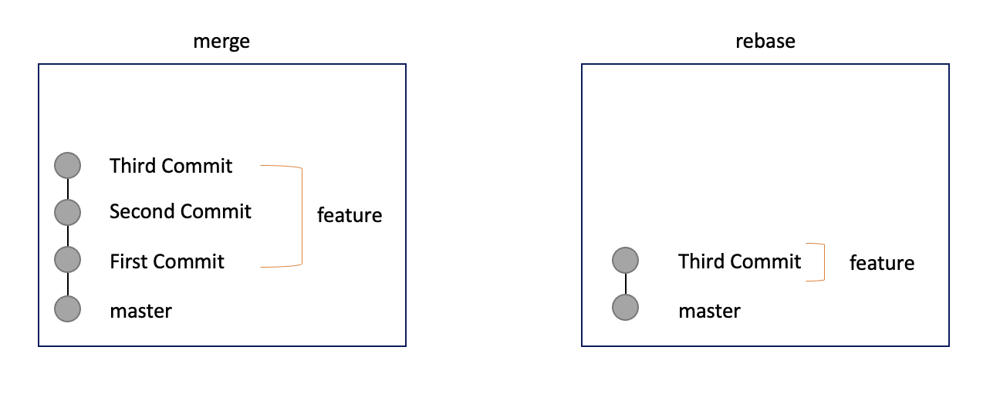

## 다른 브랜치에서 커밋을 가져오는 방법은 크게 2가지로 나뉜다.

- git merge
- git rebase

### 둘의 차이점은?
> Merge와 rebase의 큰 차이점은 하나로 합치냐 모두 가져오냐 입니다.



### git rebase를 이용해서 커밋을 합쳐보자

1. 커밋 리스트 확인

```bash
$ git log
commit a1d131c918d52ed96759d1f181e3cac96aa80031
Author: iseunghan <lsh13288@gmail.com>
Date:   Thu Aug 4 07:38:20 2022 +0000

    Third commit

commit a1d131c918d52ed96759d1f181e3cac96aa80031
Author: iseunghan <lsh13288@gmail.com>
Date:   Thu Aug 4 07:38:20 2022 +0000

    Second commit

commit a1d131c918d52ed96759d1f181e3cac96aa80031
Author: iseunghan <lsh13288@gmail.com>
Date:   Thu Aug 4 07:38:20 2022 +0000

    First commit
```

3개의 커밋이 있다고 가정합니다.

1. git rebase로 합치기

```bash
$ git rebase -i @~3
pick 1cc4c33 First Commit
pick 8973c50 Second Commit # pick -> s
pick a1d131c Third Commit  # pick -> s

# Rebase fcf15ab..91a8b37 onto fcf15ab (4 commands)
#
# Commands:
# p, pick <commit> = use commit
# r, reword <commit> = use commit, but edit the commit message
# e, edit <commit> = use commit, but stop for amending
# s, squash <commit> = use commit, but meld into previous commit
# f, fixup [-C | -c] <commit> = like "squash" but keep only the previous
#                    commit's log message, unless -C is used, in which case
#                    keep only this commit's message; -c is same as -C but
#                    opens the editor
# x, exec <command> = run command (the rest of the line) using shell
# b, break = stop here (continue rebase later with 'git rebase --continue')
# d, drop <commit> = remove commit
# l, label <label> = label current HEAD with a name
# t, reset <label> = reset HEAD to a label
# m, merge [-C <commit> | -c <commit>] <label> [# <oneline>]
# .       create a merge commit using the original merge commit's
# .       message (or the oneline, if no original merge commit was
# .       specified); use -c <commit> to reword the commit message
#
# These lines can be re-ordered; they are executed from top to bottom.
#
# If you remove a line here THAT COMMIT WILL BE LOST.
#
# However, if you remove everything, the rebase will be aborted.
```

1. 최종 변경된 모습

```bash
$ git rebase -i @~3
pick 1cc4c33 First Commit
s 8973c50 Second Commit # pick -> s
s a1d131c Third Commit  # pick -> s

# Rebase fcf15ab..91a8b37 onto fcf15ab (4 commands)
#
# Commands:
# p, pick <commit> = use commit
# r, reword <commit> = use commit, but edit the commit message
# e, edit <commit> = use commit, but stop for amending
# s, squash <commit> = use commit, but meld into previous commit
# f, fixup [-C | -c] <commit> = like "squash" but keep only the previous
#                    commit's log message, unless -C is used, in which case
#                    keep only this commit's message; -c is same as -C but
#                    opens the editor
# x, exec <command> = run command (the rest of the line) using shell
# b, break = stop here (continue rebase later with 'git rebase --continue')
# d, drop <commit> = remove commit
# l, label <label> = label current HEAD with a name
# t, reset <label> = reset HEAD to a label
# m, merge [-C <commit> | -c <commit>] <label> [# <oneline>]
# .       create a merge commit using the original merge commit's
# .       message (or the oneline, if no original merge commit was
# .       specified); use -c <commit> to reword the commit message
#
# These lines can be re-ordered; they are executed from top to bottom.
#
# If you remove a line here THAT COMMIT WILL BE LOST.
#
# However, if you remove everything, the rebase will be aborted.
```

`:wq` 로 빠져나온다.

1. 커밋 정리

```bash
# This is a combination of 4 commits.
# This is the 1st commit message:

First commit
# This is the commit message #2:

Second commit
# This is the commit message #3:

Third commit

# Please enter the commit message for your changes. Lines starting
# with '#' will be ignored, and an empty message aborts the commit.
#
# Date:      Thu Aug 4 07:25:11 2022 +0000
#
# interactive rebase in progress; onto fcf15ab
# Last commands done (4 commands done):
#    squash a1d131c Update .gitlab-ci.yml file
#    squash 91a8b37 Update .gitlab-ci.yml file
# No commands remaining.
# You are currently rebasing branch 'deploy' on 'fcf15ab'.
#
# Changes to be committed:
#       new file:   .gitlab-ci.yml
#
```

1. 최종적인 모습

```bash
Third commit

# Please enter the commit message for your changes. Lines starting
# with '#' will be ignored, and an empty message aborts the commit.
#
# Date:      Thu Aug 4 07:25:11 2022 +0000
#
# interactive rebase in progress; onto fcf15ab
# Last commands done (4 commands done):
#    squash a1d131c Update .gitlab-ci.yml file
#    squash 91a8b37 Update .gitlab-ci.yml file
# No commands remaining.
# You are currently rebasing branch 'deploy' on 'fcf15ab'.
#
# Changes to be committed:
#       new file:   .gitlab-ci.yml
#
```

1. 커밋 확인

```bash
$ git log
commit a1d131c918d52ed96759d1f181e3cac96aa80031
Author: iseunghan <lsh13288@gmail.com>
Date:   Thu Aug 4 07:38:20 2022 +0000

    Third commit

```


## REFERENCES

[git rebase 하는 방법](https://flyingsquirrel.medium.com/git-rebase-%ED%95%98%EB%8A%94-%EB%B0%A9%EB%B2%95-ce6816fa859d)