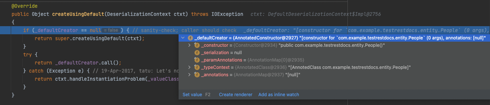
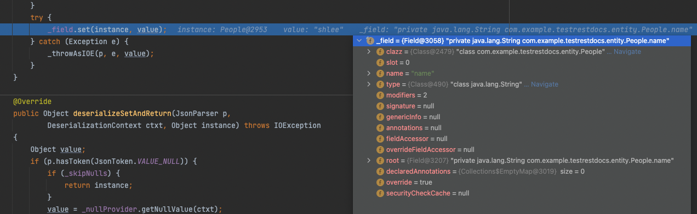

# ObjectMapper 원리를 알아보자

## ObjectMapper?

Jackson 라이브러리 클래스 중 하나인 ObjectMapper 통해 `JSON → Object`(역직렬화), `Object → JSON`(직렬화)를 간단하게 파싱할 수 있는 라이브러리 입니다.

## readValue()

- test.json

```java
{
	"name" : "john",
	"age" : 20
}
```

- `json → Object` 비직렬화 코드

```java
People people = objectMapper.readValue(new File("static/test.json"), People.class);
```

people의 각 값을 찍어보면 잘 출력됩니다.

```java
System.out.println(people.getName() + ", " + people.getAge());

// john, 20
```

그런데 말입니다.. People에 코드를 한번 볼까요..?

```java
@Getter
@NoArgsConstructor
@AllArgsConstructor
public class People {
	private String name;
	private int age;
}
```

??? Setter가 없습니다..? 그럼 어떻게 값을 넣어준걸까요..? ~~(저는 Setter를 통해서 값을 넣어주는 걸로 알고 있었습니다만..)~~

아래에서 천천히 한번 알아보겠습니다.

## 동작 방식

```java
protected JavaType _fromAny(ClassStack context, Type srcType, TypeBindings bindings)
    {
        JavaType resultType;

        // simple class?
        if (srcType instanceof Class<?>) {
            // Important: remove possible bindings since this is type-erased thingy
            resultType = _fromClass(context, (Class<?>) srcType, EMPTY_BINDINGS);
        }
```

- 해당 클래스 타입을 먼저 찾습니다.

### 핵심 부분

비직렬화 할 때, 기본 사용자는 필수입니다. 왜냐구요?

BeanDeserializer.java

```java
@Override
    public Object deserialize(JsonParser p, DeserializationContext ctxt) throws IOException
    {
        // common case first
        if (p.isExpectedStartObjectToken()) {
            if (_vanillaProcessing) {
                return vanillaDeserialize(p, ctxt, p.nextToken());    // (1)
            }
            // 23-Sep-2015, tatu: This is wrong at some many levels, but for now... it is
            //    what it is, including "expected behavior".
            p.nextToken();
            if (_objectIdReader != null) {
                return deserializeWithObjectId(p, ctxt);
            }
            return deserializeFromObject(p, ctxt);
        }
        return _deserializeOther(p, ctxt, p.currentToken());
    }
```

(1) Json을 파싱할 Parser와, DeserializationContext를 가지고 vanillaDeserialize를 호출합니다.

vanillaDeserializer()

```java
private final Object vanillaDeserialize(JsonParser p,
    		DeserializationContext ctxt, JsonToken t)
        throws IOException
    {
        final Object bean = _valueInstantiator.createUsingDefault(ctxt);    // (1)
        // [databind#631]: Assign current value, to be accessible by custom serializers
        p.setCurrentValue(bean);
        if (p.hasTokenId(JsonTokenId.ID_FIELD_NAME)) {
            String propName = p.currentName();    // (2)
            do {
                p.nextToken();
                SettableBeanProperty prop = _beanProperties.find(propName);    // (3)

                if (prop != null) { // normal case
                    try {
                        prop.deserializeAndSet(p, ctxt, bean);    // (4)
                    } catch (Exception e) {
                        wrapAndThrow(e, bean, propName, ctxt);
                    }
                    continue;
                }
                handleUnknownVanilla(p, ctxt, bean, propName);
            } while ((propName = p.nextFieldName()) != null);    // (5)
        }
        return bean;
    }
```

- (1) createUsingDefault를 호출해 기본 생성자를 통해 인스턴스를 생성합니다.
    
    StdValueInstantiator.java
    
    ```java
    @Override
    public Object createUsingDefault(DeserializationContext ctxt) throws IOException
    {
        if (_defaultCreator == null) { // sanity-check; caller should check
            return super.createUsingDefault(ctxt);
        }
        try {
            return _defaultCreator.call();    // (1-A)
        } catch (Exception e) { // 19-Apr-2017, tatu: Let's not catch Errors, just Exceptions
            return ctxt.handleInstantiationProblem(_valueClass, null, rewrapCtorProblem(ctxt, e));
        }
    }
    ```
    
    (1-A) _defaultCreator를 call() 하는 것을 볼 수 있습니다.
    
    
    
    AnnotatedConstructor.java
    
    ```java
    @Override
    public final Object call() throws Exception {
        // 31-Mar-2021, tatu: Note! This is faster than calling without arguments
        //   because JDK in its wisdom would otherwise allocate `new Object[0]` to pass
        return _constructor.newInstance((Object[]) null);    // (1-B)
    }
    ```
    
    (1-B) 디버깅을 해보면 기본 생성자를 호출하는 것을 보실 수 있습니다.
    
    
    
    이렇게 생성한 객체는 반환하여  BeanDeserializer로 던집니다.
    

(2) p.currentName()을 통해서 json에서 프로퍼티 이름을 파싱합니다.

- (3) 아래 find 메소드를 통해서 프로퍼티 이름을 가져옵니다.
    
    ```java
    public SettableBeanProperty find(String key)
        {
            if (key == null) {
                throw new IllegalArgumentException("Cannot pass null property name");
            }
            if (_caseInsensitive) {
                key = key.toLowerCase(_locale);
            }
    
            // inlined `_hashCode(key)`
            int slot = key.hashCode() & _hashMask;
    //        int h = key.hashCode();
    //        int slot = (h + (h >> 13)) & _hashMask;
    
            int ix = (slot<<1);
            Object match = _hashArea[ix];
            if ((match == key) || key.equals(match)) {
                return (SettableBeanProperty) _hashArea[ix+1];
            }
            return _find2(key, slot, match);
        }
    ```
    
    없는 프로퍼티가 있는 경우 find 메소드에서 null을 반환하여 Exception이 터지는 것 같습니다. (정확하게는 확인하지 못했습니다.. 아시는분은 꼭 댓글 부탁드립니다..)
    
- (4) 해당 프로퍼티의 값을 역직렬화를 하여 값을 설정합니다.
    
    FieldProperty.java
    
    ```java
    @Override
    public void deserializeAndSet(JsonParser p,
    		DeserializationContext ctxt, Object instance) throws IOException
    {
        Object value;
        if (p.hasToken(JsonToken.VALUE_NULL)) {
            if (_skipNulls) {
                return;
            }
            value = _nullProvider.getNullValue(ctxt);
        } else if (_valueTypeDeserializer == null) {
            value = _valueDeserializer.deserialize(p, ctxt);    // (1)
            // 04-May-2018, tatu: [databind#2023] Coercion from String (mostly) can give null
            if (value == null) {
                if (_skipNulls) {
                    return;
                }
                value = _nullProvider.getNullValue(ctxt);
            }
        } else {
            value = _valueDeserializer.deserializeWithType(p, ctxt, _valueTypeDeserializer);
        }
        try {
            _field.set(instance, value);    // (2)
        } catch (Exception e) {
            _throwAsIOE(p, e, value);
        }
    }
    ```
    
    (1) 역직렬화를 통해 해당 프로퍼티의 값을 가져옵니다.
    
    (2) 이전에 생성한 Test 인스턴스에 해당 값을 저장합니다.
    
    여기서 _field를 찍어보면 해당 필드에 직접 주입을 하고 있습니다.
    
    
    

(5) 다음 프로퍼티가 없을 때까지 이를 반복합니다.

자 이제 모든 의문이 풀렸습니다.

### How Jackson ObjectMapper Matches JSON Fields to Java Fields

> To read Java objects from JSON with Jackson properly, it is important to know how Jackson maps the fields of a JSON object to the fields of a Java object, so I will explain how Jackson does that.
> 
> By default Jackson maps the fields of a JSON object to fields in a Java object by matching the names of the JSON field to the getter and setter methods in the Java object. Jackson removes the "get" and "set" part of the names of the getter and setter methods, and converts the first character of the remaining name to lowercase.
> 
> For instance, the JSON field named `brand` matches the Java getter and setter methods called `getBrand()` and `setBrand()`. The JSON field named `engineNumber` would match the getter and setter named `getEngineNumber()` and `setEngineNumber()`.
> 
> If you need to match JSON object fields to Java object fields in a different way, you need to either use a custom serializer and deserializer, or use some of the many **[Jackson Annotations](https://jenkov.com/java-json/jackson-annotations.html)**.
> 

- [https://jenkov.com/tutorials/java-json/jackson-objectmapper.html#how-jackson-objectmapper-matches-json-fields-to-java-fields](https://jenkov.com/tutorials/java-json/jackson-objectmapper.html#how-jackson-objectmapper-matches-json-fields-to-java-fields)

JSON의 필드값을 Java 객체의 필드값이랑 매핑 시킬 때 Java 객체의 필드값을 찾는게 아니고 Getter, Setter 메소드 명에서 `get`, `set` 를 제외한 나머지 문자열을 소문자로 변경한 뒤 매칭 시킨다는 것입니다..!

진짜인지 확인해볼까요?

```java
@NoArgsConstructor
@AllArgsConstructor
public class People {

    private String name;

    private int age;

    private String city;

    public String getName() {
        return name;
    }

    public int getAge() {
        return age;
    }

		// city의 getter가 없음!
}
```

city의 getter를 제거해봤습니다.

그리고 아래 테스트를 돌려보면.?

```java
@Test
void objectMapper_test() throws IOException {

    String json = "{ \"name\" : \"shlee\", \"age\" : 5, \"city\" : \"city\"}";
    Reader reader = new StringReader(json);

    ObjectMapper objectMapper = new ObjectMapper();
    People people = objectMapper.readValue(reader, People.class);
}
```

두둥..! city를 찾을 수 없다고 합니다..!

```java
Unrecognized field "city" (class com.example.testrestdocs.entity.People), not marked as ignorable (2 known properties: "name", "age"])
 at [Source: (StringReader); line: 1, column: 42] (through reference chain: com.example.testrestdocs.entity.People["city"])
com.fasterxml.jackson.databind.exc.UnrecognizedPropertyException: Unrecognized field "city" (class com.example.testrestdocs.entity.People), not marked as ignorable (2 known properties: "name", "age"])
 at [Source: (StringReader); line: 1, column: 42] (through reference chain: com.example.testrestdocs.entity.People["city"])
```

- city의 getter 또는 setter를 추가하면 테스트가 통과하게 됩니다.
