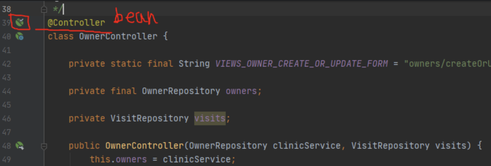

# [Spring] Bean, IoC
## Application Context
스프링에는 가장 핵심이 되는 개념이 있다. 바로 `Application Context`이다.

`Application Context`를 `Bean Factory` 또는 `스프링 IoC 컨테이너` 라고도 부르기도 한다.

`Application Context`는 `Bean Factory`를 상속한다.

여기서 말하는 `Bean Factory`는 `Bean`을 만들고, 그 `Bean`들의 의존성을 엮어준다. 

여기서 `Bean Factory`가 객체를 관리하므로 **IoC 개념**이 적용이 되어 `IoC Container`라고도 한다.

* 빈이 주입되는 예시 코드
OwnerController는 `@Controller` 어노테이션이 붙어있기 때문에 자동으로 `Bean`으로 등록이 되고, `Bean Factory`에서 `OwnerRepository`라는 `Bean`을 찾아서 주입 시켜주는 방식이다.
``` java
@Controller
class OwnerController {
	private final OwnerRepository owners;

	public OwnerController (OwnerRepository owners) {
		this.owners = owners;
	}
}

```

## Component Scan
> 총 3가지 방법이 있다.

* Annotation (어노테이션)
	* @Component
	* @Repository
	* @Controller
	* @Service

Class 상단에 위 어노테이션을 붙이게 되면 자동으로 `IoC 컨테이너`에 Bean으로 등록이 된다.
(옆에 콩 모양이 뜬다.)


* @Bean
`@Bean` 어노테이션을 붙여서 빈을 직접 등록하는 방법이다.
등록할 때에는 항상 `@Configuration`이 붙은 클래스 안에 정의해야 한다.
(`@SpringApplication`에는 `@Configuration`이 있다.)

```java
@SpringBootApplication
public class PetClinicApplication {
	@Bean
	public String bean_name() {
		return "bean_name";
	}
	...
}
```
