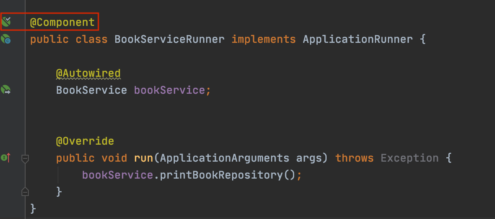

# [Spring] Bean, IoC

## Application Context

스프링에는 가장 핵심이 되는 개념이 있다. 바로 `Application Context`이다.

`Application Context`를 `Bean Factory` 또는 `스프링 IoC 컨테이너` 라고도 부르기도 한다.

`Application Context`는 `Bean Factory`를 상속한다.

여기서 말하는 `Bean Factory`는 `Bean`을 만들고, 그 `Bean`들의 의존성을 엮어준다. 

여기서 `Bean Factory`가 객체를 관리하므로 **IoC 개념**이 적용이 되어 `IoC Container`라고도 한다.

* 빈이 주입되는 예시 코드
OwnerController는 `@Controller` 어노테이션이 붙어있기 때문에 자동으로 `Bean`으로 등록이 되고, `Bean Factory`에서 `OwnerRepository`라는 `Bean`을 찾아서 주입 시켜주는 방식이다.

``` java
@Controller
class OwnerController {
	private final OwnerRepository owners;

	public OwnerController (OwnerRepository owners) {
		this.owners = owners;
	}
}

```

## Bean 등록하기

> Component Scan

어느 패키지 이하로부터 `@Component` 어노테이션이 붙은 (정확히는 `@Component` 또는  `@Component` 메타 어노테이션을 갖는) 클래스를 찾아서 빈으로 자동 등록해준다.

`@ComponentScan(basePackageClasses = TestApplication.class)` 이런 식으로 붙여주면 해당 클래스가 속한 패키지 이하에 있는 모든 클래스를 스캔을 한다.

스프링 부트 프로젝트를 생성하면 메인 클래스에 `@SpringBootApplication`가 붙은 것을 볼 수 있다. 해당 어노테이션은 `@ComponentScan`을 포함하고 있으므로 자동으로 ComponentScan을 한다.

* Annotation (어노테이션)
	* `@Component`
	* `@Repository`
	* `@Controller`
	* `@Service`

Class 상단에 위 어노테이션을 붙이게 되면 자동으로 `IoC 컨테이너`에 Bean으로 등록이 된다. (옆에 콩 모양이 뜬다.)



* @Bean

`@Bean` 어노테이션을 붙여서 빈을 직접 등록하는 방법이다.
등록할 때에는 항상 `@Configuration`이 붙은 클래스 안에 정의해야 한다.
(`@SpringApplication`에는 `@Configuration`이 있다.)

```java
@SpringBootApplication
public class PetClinicApplication {
	@Bean
	public String bean_name() {
		return "bean_name";
	}
	...
}
```

## 의존성 주입 (Dependency Injection, DI)

### @Autowired

* required: true (defualt), 따라서 의존성 주입에 실패하면 application 구동 실패!


* 필드 주입

```java
@Controller
public class TestController {
	@Autowired
	String bean_name;	// String 타입의 bean_name이라는 이름을 가진 Bean을 사용하겠다는 뜻. 컨테이너가 직접 찾아서 빈을 주입해준다. (Injection)
}
```

* 생성자 주입

```java
@Controller
public class TestController {

	private TestService testService;

	@Autowired
	public TestController(TestService testService) {
		this.testService = testService;
	}
}
```


* 생성자 (without `@Autowired`)

```java
@Controller
public class TestController {

	private TestService testService;

	public TestController(TestService testService) {
		this.testService = testService;
	}
}
```

만약 `TestService`가 빈으로 등록(`@Service`)되어 있고, `TestController`가 빈으로 등록이 되어있고 해당 `TestService`를 받는 생성자가 단 하나일 때 `@Autowired`를 자동으로 붙여준다.

* Setter 주입

```java
@Autowired
public void setTestService(TestService testService) {
	this.testService = testService;
}
```

## 같은 타입의 빈이 여러 개 일 때 (feat. 내가 주입 받은 빈을 확인해보기)
* `@Primary`
* `@Qualify("bean_name")`
* 모두 주입 받기

---

* `Runner` 생성

```java
@Component
public class ApplicationRunner implements ApplicationRunner {
	@Autowired
	TestService testService;

	@Override
	public void run(ApplicationArguments args) throws Exception {
		testService.printTestRepository();
	}
}
```

* `TestService`

```java
@Service
public class TestService {
	@Autowired
	TestRepository testRepository;

	public void printTestRepository() {
		System.out.println(testRepository.getClass());
	}
}
```


### @Primary

* `Temp1_Repository`

```java
@Repository
public class Temp1_Repository implements TestRepository {

}
```

* `Temp2_Repository`

```java
@Primary	// **
@Repository
public class Temp2_Repository implements TestRepository {

}
```

같은 타입의 빈이 2개가 있는데 과연 어떤 빈이 주입이 될까요?

앞서 만들었던 `Runner`를 실행해보면 아래와 같이 찍힐 것이다.

```
class com.example.demospring51.Temp2_Repository
```

`@Primary`를 붙여준 빈이 주입이 된다.
만약 `@Primary`를 붙여주지 않았을 때에는 주입할 빈이 모호하다는 오류가 발생한다.

### @Qualify("bean_name")

이 방법보단 `@Primary`가 안전하다.

```java
@Autowired
@Qualify("temp2_Repository")
TestRepository testRepository;
```

### 모두 주입 받기
List 타입으로 받으면 모든 빈을 받을 수 있다.

```java
@Autowired
List<TestRepository> testRepositories;
```